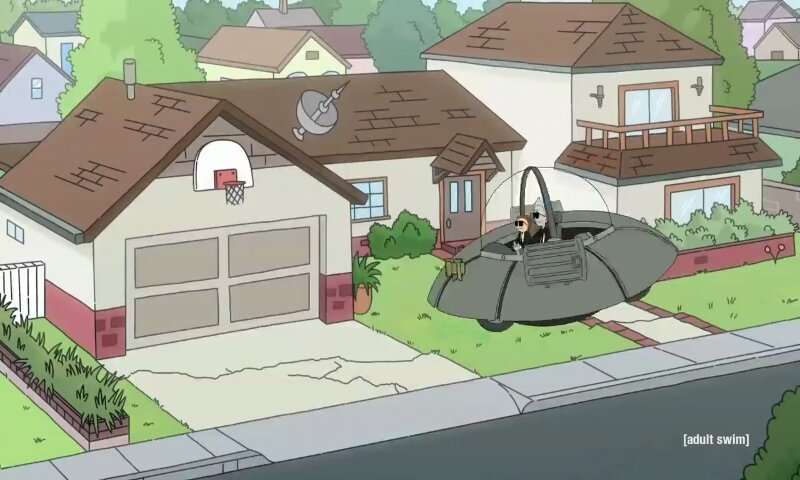
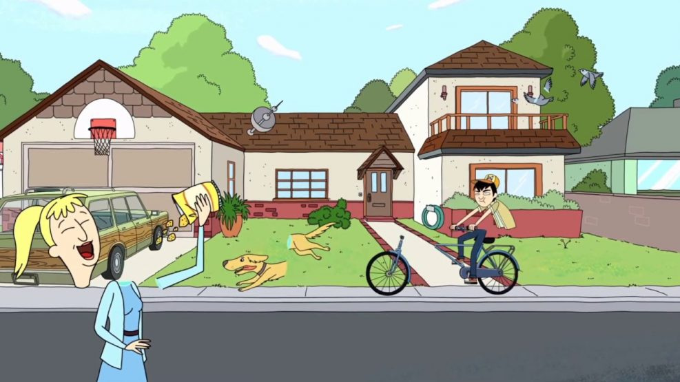
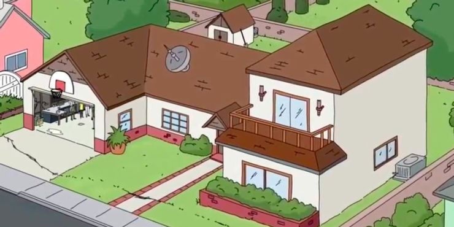

# Toon3D

<i>Humans can perceive 3D world from images that aren't 3D consistent, but why can't machines?</i> This project enables 3D reconstruction of non-geometrically consistent scenes, such as cartoons. _We take a few images from a cartoon and reconstruct it in 3D. Our project page is at [https://toon3d.studio/](https://toon3d.studio/).

|   Image 1   |   Image 2   |   Image 3   |
| :------------------------: | :--------------------------: | :-------------------------: |
|  |  |  |

# Setting up the environment

Create a conda environment and install Toon3D.

```bash
pip install -e .
```

# Download Toon3D Dataset scenes

Download the Toon3D Dataset from [here](https://huggingface.co/datasets/ethanweber/toon3d-dataset) and place the dataset folders in `data/processed`.

# Running the full SfM pipeline (optional, for custom data)

This section walks you through starting from a small collection of images, annotating them, and running our custom SfM to create the initial dataset. This is how we created the pre-processed datasets, available above.

## Obtain images

You can download one of our image collections from [this Google Drive link](https://drive.google.com/drive/folders/11ogFtOOBB-UIq6seMukYncqqFacxBn5-?usp=drive_link) or simply use your own. Place the images in a folder within the parent directory such as `data/images/[dataset]`, where [dataset] is the dataset name. To get started, download the `bobs-burgers-dining` images and follow the instructions below.

## Process Data

This step runs depth estimation and Segment Anything (SAM).

Install with 

```bash
pip install segment_anything @ git+https://github.com/facebookresearch/segment-anything.git
```

Download [SAM](https://github.com/facebookresearch/segment-anything) weights with `tnd-download-data sam`.

Now, you can run

```bash
tnd-process-data initialize --dataset [dataset] --input_path [input_path]
```

Where the `input_path` is the source folder of your images while `dataset` is the name of the dataset that will be output to `data/processed/[dataset]`

For example,

```bash
tnd-process-data initialize --dataset bobs-burgers-dining --input_path data/images/bobs-burgers-dining
```

If you want to add more images to your dataset after initializing it, run this

```bash
tnd-process-data add --dataset bobs-burgers-dining --input_path data/images/more-bobs-burgers-dining-photos
```

## Label images

You can use [labeler.toon3d.studio](https://labeler.toon3d.studio/).

You have two ways of getting your data in the viewer.

(1) **Uploading ZIP folders**

You can either upload a zipped process-data folder or simply a selection of images. If just images, you'll have more limited functionality (no depth images or SAM masks).

(2) **No-upload version for faster development**

Expose your processed data to a public URL. Here is an example with our script with CORS allowed for any origin. You can change the port or the relative directory from which to host the files from.

```bash
tnd-server --path data/processed --port 8000
```

Now, open your processed dataset and annotate.

Navigate to https://labeler.toon3d.studio/?path=http://localhost:8000/[dataset] in this case.

For example: https://labeler.toon3d.studio/?path=http://localhost:8000/bobs-burgers-dining

## Run structure from motion!

Now we can run our method to get a dense 3D reconstruction for novel-view synthesis.

For example,

```bash
tnd-run --dataset bobs-burgers-dining
```

# Run dense reconstruction!

For example,

```bash
ns-train toon3d --data data/nerfstudio/bobs-burgers-dining
```

Render a camera path that you created

```bash
tnd-render camera-path --load-config [load-config] --camera-path-filename [camera-path-filename] --output-path [output-path].mp4
```

Render videos between training views

```bash
tnd-render interpolate --load-config [load-config] --output-path [output-path]
```

# Project structure

The `outputs` folder is organized according to the types of experiments conducted.

```bash
outputs/[dataset]/run/[timestamp]       # For SfM experiments
outputs/[dataset]/toon3d/[timestamp]    # For MVS experiments
```

# Citing

If you find this code or data useful for your research, please consider citing the following paper:

    @inproceedings{weber2023toon3d,
    title = {Toon3D: Seeing Cartoons from a New Perspective},
    author = {Ethan Weber* and Riley Peterlinz* and Rohan Mathur and
        Frederik Warburg and Alexei A. Efros and Angjoo Kanazawa},
    booktitle = {arXiv},
    year = {2024},
    }